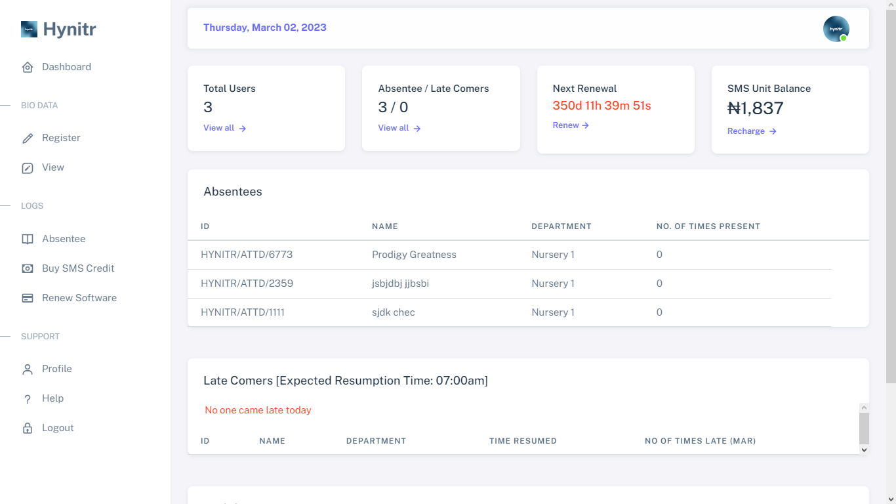
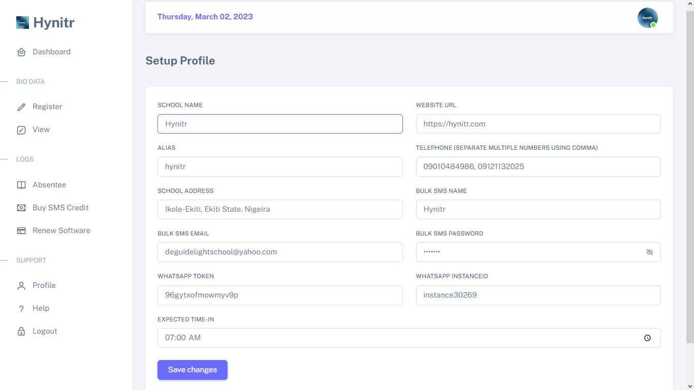

# 🛠 Updating Your Software Settings

## Step 1 - Login into your software

Get access to your automated attendance software by providing your valid login credentials.

<figure><figcaption></figcaption></figure>

## Step 2 - Navigate to your profile

Navigate to your profile and fill up all details gotten from your [pre-requisite](broken-reference)

<figure><figcaption></figcaption></figure>

click on "save changes".
