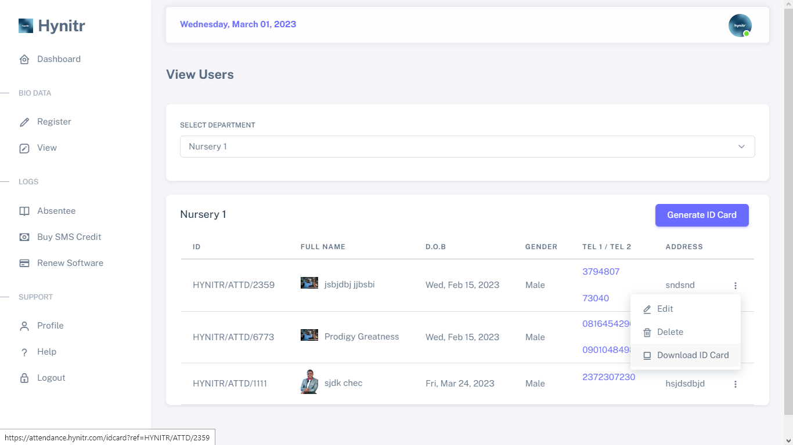

# 💳 Generating Single ID Card


Please ensure that you have followed all the necessary steps outlined in the section titled - [Viewing Users](../../product-guides/understanding-projects.md) before proceeding with any actions in this section.


## Step 1 - Click on the three vertical dots located at the end of the user's information that you intend to generate an ID Card.

Once clicked, you will get a dropdown with options. click on the "Download ID Card" option to generate the ID Card of the user you intend to.

<figure><figcaption></figcaption></figure>

<figure><figcaption></figcaption></figure>


After downloading the ID card, you may choose to print it using a hardware printer. Alternatively, you may click on the "Go Back" button to return to the software and continue with your activities.


## Summary

To print the ID card, follow the steps below:

1. Go to the "View Users" interface
2. Select the category of users you want to view
3. Locate the user whose ID card you want to print
4. Click on the three vertical dots at the end of the user's row
5. Select "Print ID Card" from the dropdown options
6. A preview of the ID card will be displayed on a new page
7. Click on the print icon or press "Ctrl+P" to print the ID card

Note that you will need to have a printer connected to your device to print the ID card.
