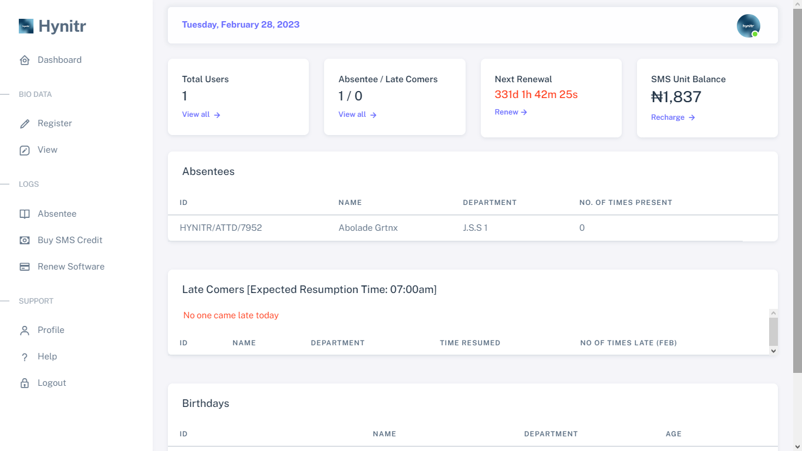
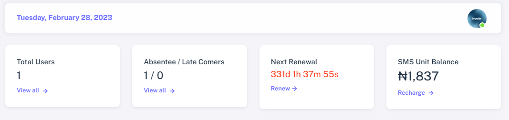

# ✨ Dashboard

<figure><figcaption></figcaption></figure>

## Information Tabs

The information tabs provide a convenient summary of activities on your dashboard and offer quick access to specific functions within the software. The below information are what the software displays;

<figure><figcaption></figcaption></figure>

* **Current Date:** The software displays the current date at the top-left corner to ensure users are aware of the specific date being viewed within the software.
* **Total Users:** This feature displays the total number of registered users on the software.
