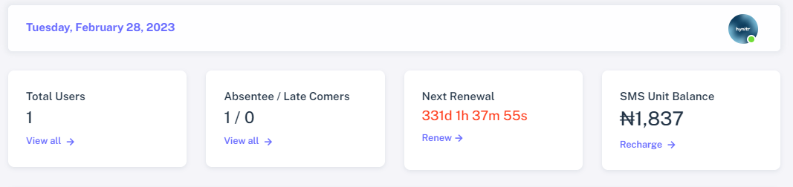

# ✨ Your Dashboard

<figure><figcaption></figcaption></figure>

## Information Tabs

The information tabs provide a convenient summary of activities on your dashboard and offer quick access to specific functions within the software. The below information are what the software displays;

<figure><figcaption></figcaption></figure>

* **Current Date:** The software displays the current date at the top-left corner to ensure users are aware of the specific date being viewed within the software.
* **Total Users:** This feature displays the total number of registered users on the software.
* **Absentees/Late Comers:** This feature provides a count of the total number of absentees and latecomers for the current day. To view the figures for other dates, users can click on the "view all" link located below the figures.
* **Next Renewal:** This feature continuously counts down to the next renewal date of the software. Failure to renew the software will result in restricted access to the software. To facilitate timely renewal, users can renew the software automatically by clicking on the "renew" link located below the countdown.
