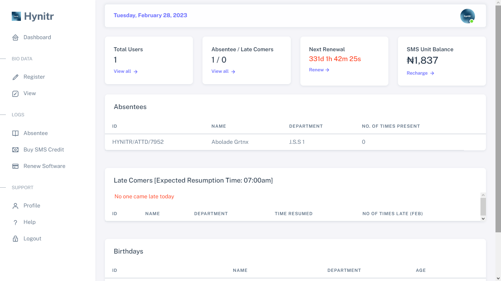

# ✨ Your Dashboard

<figure><figcaption></figcaption></figure>

## Information Tabs

The information tabs provide a convenient summary of activities on your dashboard and offer quick access to specific functions within the software. The below information are what the software displays;

<figure><figcaption></figcaption></figure>

* **Current Date:** The software displays the current date at the top-left corner to ensure users are aware of the specific date being viewed within the software.

* **Total Users:** This tab displays the total number of registered users on the software.

* **Absentees/Late Comers:** This tab provides a count of the total number of absentees and latecomers for the current day. To view the figures for other dates, users can click on the "view all" link located below the figures.

* **Next Renewal:** This tab continuously counts down to the next renewal date of the software. Failure to renew the software will result in restricted access to the software. To facilitate timely renewal, users can renew the software automatically by clicking on the "renew" link located below the countdown.


The software will no longer be functional once it reaches its renewal deadline unless it is renewed. To ensure continuous operation of the software, an annual renewal fee must be paid. It is recommended to regularly monitor the renewal timer on your dashboard to ensure timely renewal.


* **SMS Unit Balance:**  This tab displays the current balance of Bulk SMS Units in your account. To top up your account, users can click on the "recharge" link located below the figures.


In the event that the bulk SMS credit is low or depleted, SMS notifications will not be sent to parents. It is advisable to consistently monitor the attendance dashboard to obtain up-to-date information on the status of the bulk SMS credit.


## Information Tables

The information table provide a convenient summary of activities data on your dashboard. The below information are what the software displays;

<figure><figcaption></figcaption></figure>

* Absentees: This table provides a full data of the total number of absentees and latecomers for the current day.&#x20;

* Late Comers: This table
