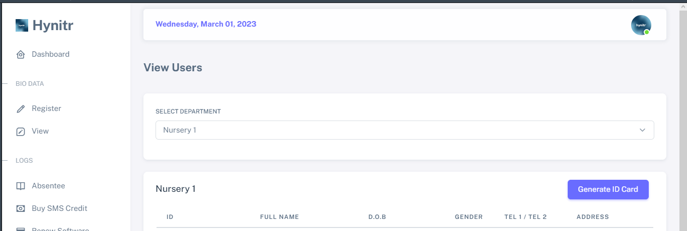
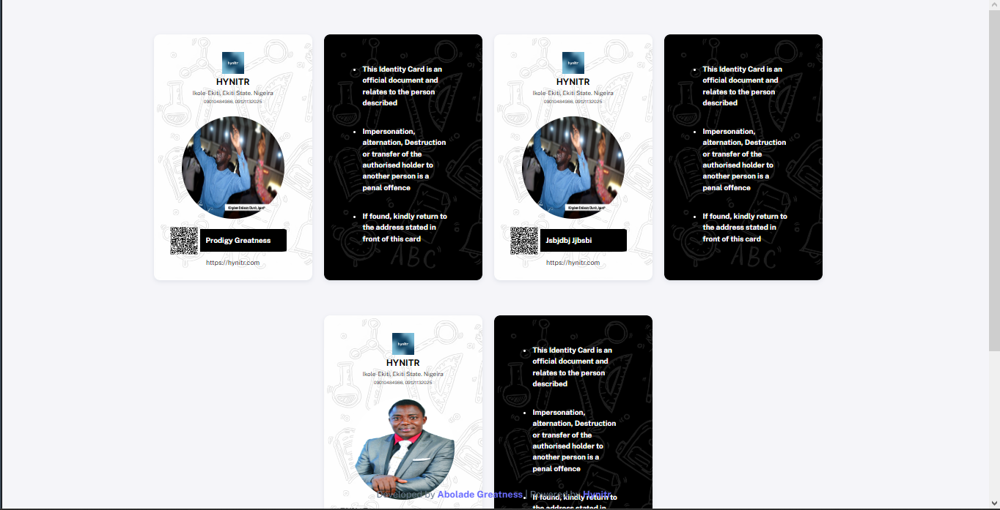

# 🗃 Generating Bulk ID Cards


Please ensure that you have followed all the necessary steps outlined in the section titled - [Viewing Users](../product-guides/understanding-projects.md) before proceeding with any actions in this section.


## Click on "Generate ID Card" button.

This will generate all the ID card for users that are in the selected category.

<figure><figcaption></figcaption></figure>

<figure><figcaption></figcaption></figure>


You can always print the ID card and give to users for tracking their attendance.

