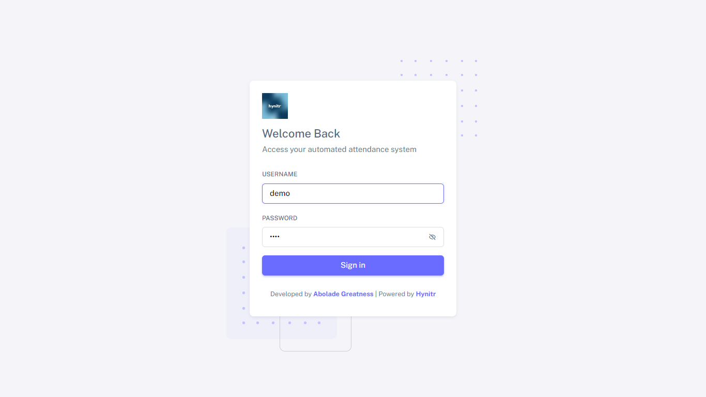

# ⚙ Accessing your Account


Your access to your attendance management system is usually in this format: _**https://attendance.yourwebsitename.com.**_

_****_

Your password and username are usually sent to your email when you purchase the software via [Hynitr](https://hynitr.com) or[ https://softwares.hynitr.com/attendance-management-system](https://softwatres.hynitr.com/attendance-management-system)


## Demo Access


You can access the demo account using the link;

[https://attendance.hynitr.com](https://attendance.hynitr.com)\
\
To get login access, kindly click on the link below to get access;\
[Click me to get access](https://api.whatsapp.com/send?phone=2348102569402\&text=hello,%20i%20need%20access%20to%20the%20attendance%20software.)


## Signing-in

After getting your sign-in link, you will be presented with the below screen to input your username and password.&#x20;

<figure><figcaption></figcaption></figure>


Repeated attempts to log in with invalid credentials may result in temporary suspension of your account. Please ensure to use only the valid credentials sent to your email upon purchase of the software.

