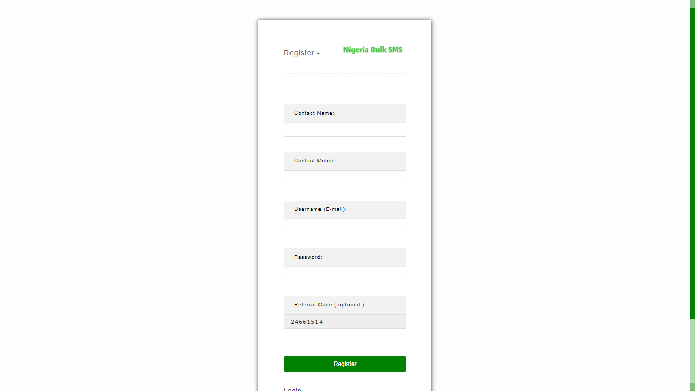

# 📩 Creating Your Bulk SMS Account


The automated attendance software only works with - **Nigeria Bulk SMS Platform.**

&#x20;**ANY OTHER PLATFORM WON'T WORK!**.&#x20;

Kindly follow the procedures below to create an account.


## Step 1 - Sign Up on Nigeria Bulk SMS&#x20;

Begin your process by creating a free account on Nigeria Bulk SMS Platform using this link - [http://portal.nigeriabulksms.com/register/?referral=24661514](http://portal.nigeriabulksms.com/register/?referral=24661514)&#x20;

<figure><figcaption></figcaption></figure>

## Step 2 - Activate your account

Confirm your email address by clicking on the link sent to your email inbox by Nigeria Bulk SMS. This will activate your account and enable you to start using the service. Please note that the confirmation process is usually instant.

## Step 3 - Fund your account

To enable your account to send SMS, we kindly request that you fund your account with a minimum amount of NGN2,000. This will ensure that your account has sufficient credit to send SMS notifications.&#x20;


You can fund your account by using this link - [https://portal.nigeriabulksms.com/recharge/](https://portal.nigeriabulksms.com/recharge/)



Upon connecting your BULK SMS platform with the attendance software, our default funding amount of NGN1,000 will be automatically credited to your account.

You can always request your account to be funded via; [https://hynitr.com/support](https://hynitr.com/support)



Please be sure to securely store your account email and password as this will be required later.


