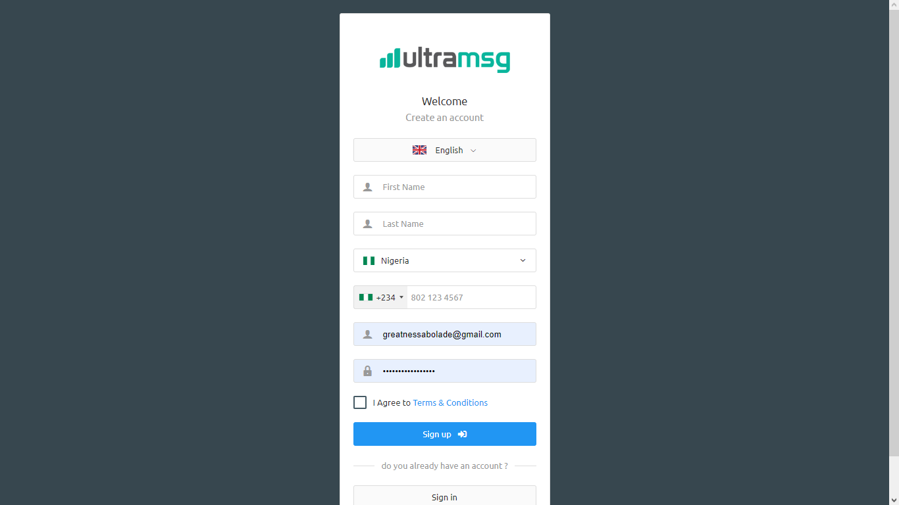

# 🟢 Enabling your WhatsApp notifications


The automated attendance software only works with - **ultramsg.com**

&#x20;**ANY OTHER PLATFORM WON'T WORK!**.&#x20;

Kindly follow the procedures below to create an account.


## Step 1 - Create an account

Begin by creating an account on Ultramsg using this link - [https://user.ultramsg.com/signup.php](https://user.ultramsg.com/signup.php)

<figure><figcaption></figcaption></figure>

## Step 2 - Activate your account

Confirm your email address by clicking on the link sent to your email inbox by Nigeria Bulk SMS. This will activate your account and enable you to start using the service. Please note that the confirmation process is usually instant.

## Step 3 - Create an instance

kindly reach out to us. We will request your account login details to complete this process.


Ultramsg provides you with a complimentary quota of 100 WhatsApp notifications. Subsequently, in order to continue utilizing the platform, you will be required to subscribe and make a payment of $39 per month.



Please be sure to securely store your **Instance ID** and **Token** as this will be required later.


##
