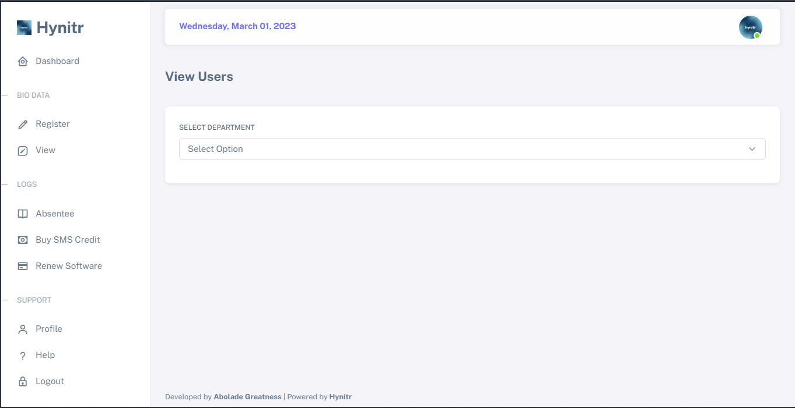
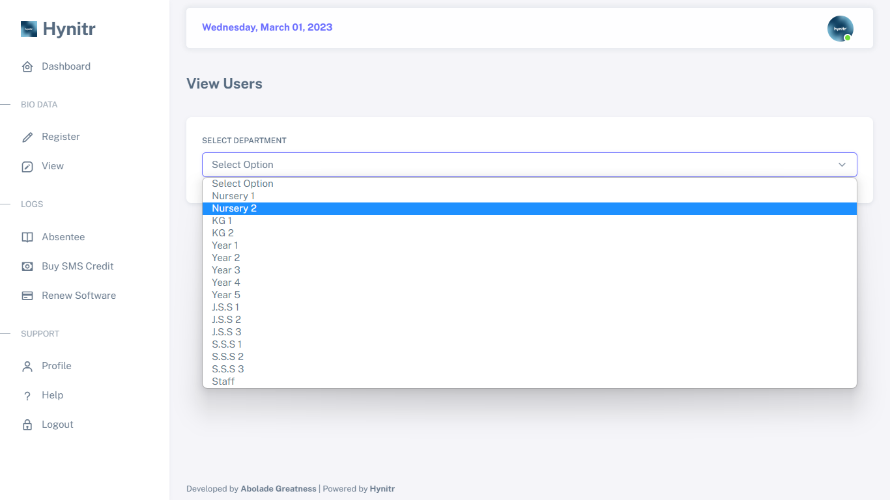
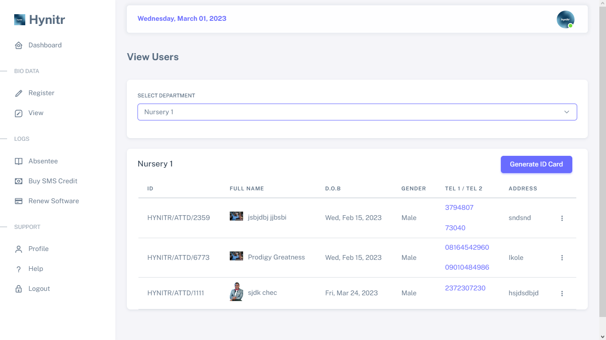

# 👀 Viewing Users

## Step 1 - Begin by clicking on the "View" component on the [menu bar/sidebar](../getting-started/menu-bar-side-bar.md)

Upon clicking, an interface will be presented to you as shown below.

<figure><figcaption></figcaption></figure>

## Step 2 - Click on "Select Option" to choose the category of users you wish to view.

<figure><figcaption></figcaption></figure>

You'll be presented with a table that displays the relevant information of the users in that category, such as their names, telephone number, and other relevant details depending on the information that was entered during registration.

<figure><figcaption></figcaption></figure>
