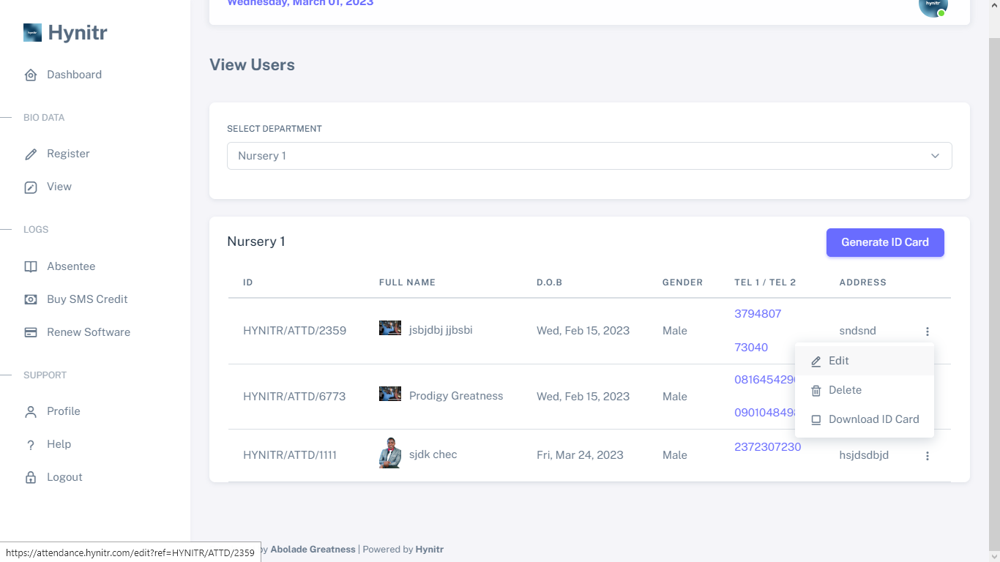
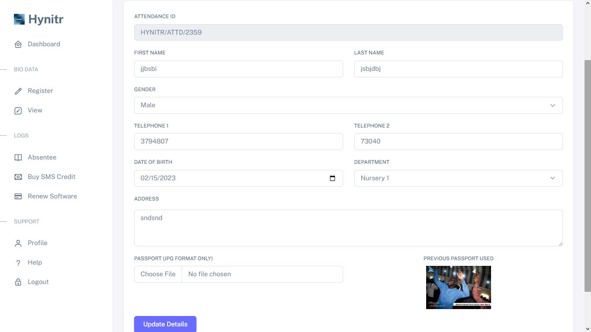

# ✏ Editing Users Details


Please ensure that you have followed all the necessary steps outlined in the section titled - [Viewing Users](viewing-users.md) before proceeding with any actions in this section.


## Step 1 - Click on the three vertical dots located at the end of the user's information that you intend to edit.

Once clicked, you will get a dropdown with options. click on the edit option to edit the details of the user you intend to.

<figure><figcaption></figcaption></figure>

After clicking on the "Edit" option, you will be directed to a page where you can make changes to the user's details. It is important to make sure that you input the correct information to avoid errors or discrepancies in the future.

## Step 2 - After clicking on the "Edit" option, you will be directed to a page where you can make changes to the user's details.&#x20;

It is important to make sure that you input the correct information to avoid errors or discrepancies in the future.

<figure><figcaption></figcaption></figure>


Once you are done editing, click on the "Update Details" button to update the user details.

After updating the user details, make sure to check for any error notifications to ensure that the update was successful.

