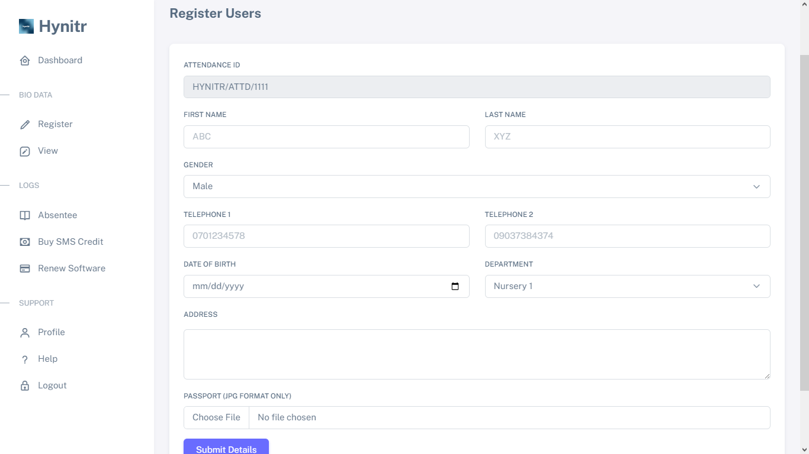
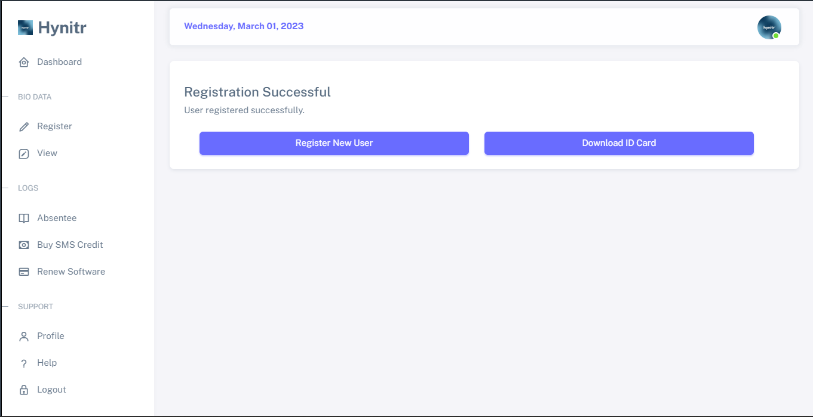

# 👪 Registering Users

## Step 1 - Click on "Register" on your menu-bar/sidebar


Check previous page to see the [menu-bar/sidebar](../getting-started/menu-bar-side-bar.md)


The profile interface allows users to input all necessary details. For accuracy, please ensure that all details are entered correctly. Users can edit or delete details using the "View" component of the [menu-bar/sidebar](../getting-started/menu-bar-side-bar.md)

<figure><figcaption></figcaption></figure>


The software automatically generates a unique "Attendance ID" for each user. This ID serves as a unique identifier for users within the software. By default, the ID is not displayed on the user ID card unless the feature is enabled from the profile settings.



Filling in the "Telephone 1" field is of utmost importance, while "Telephone 2" can be left blank as it is optional. It is mandatory to fill in all other fields except for these two.



The software only allows for JPEG and JPG image types when uploading student passport photos. Other image types are not supported.


## Step 2 - Click on the "Submit Details" button to submit


Upon submitting your registration, it is crucial to pay close attention to any error notifications that may appear. These notifications will inform you whether your registration was successful or not.


After submitting your registration, the user's records are saved to the database. If successful, a confirmation interface is displayed to indicate that the registration process has been completed.

<figure><figcaption></figcaption></figure>


Upon completion of the registration process, you have the option to either continue registering new users by clicking the "Register New User" button, or preview/download the user's ID card by clicking the "Download ID Card" button..


<figure><figcaption></figcaption></figure>


After downloading the ID card, you may choose to print it using a hardware printer. Alternatively, you may click on the "Go Back" button to return to the software and continue with your activities.



You can always download the user ID card from the "View" component of the [menu-bar/sidebar](../getting-started/menu-bar-side-bar.md)

